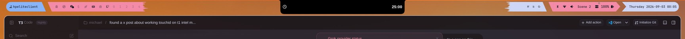
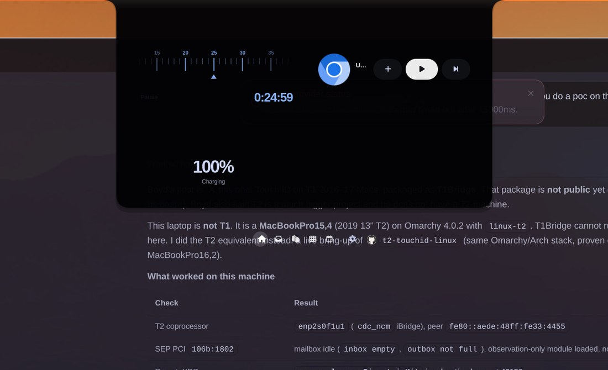
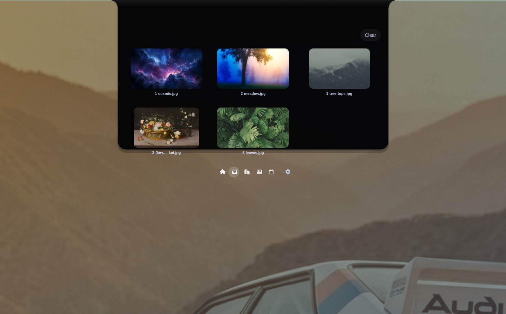
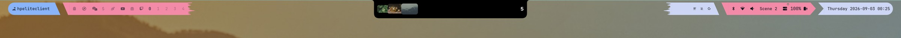
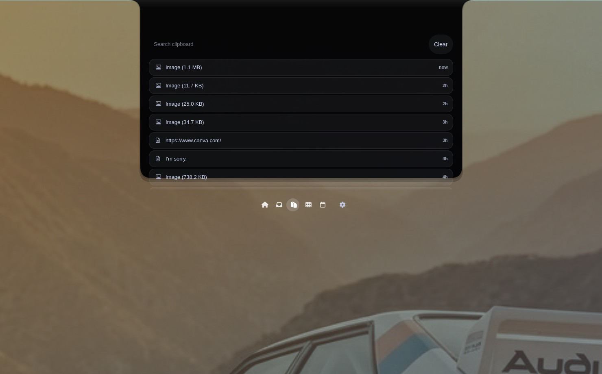
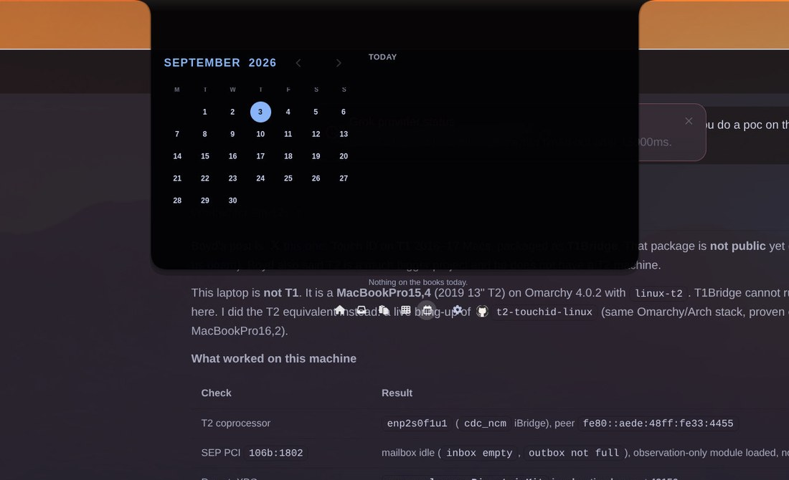

# Naarchy

Your MacBook notch, on Linux. A shelf. A clipboard. A timer that takes over the
screen when it hits zero.

Native GTK4 on Omarchy / Hyprland. MIT. Not Electron. Not a blurry fog hanging
off the camera. A black glass island that fills the hole and grows ears when
something is live.

https://github.com/user-attachments/assets/959a779c-8d26-4f23-855d-08b9b4a300fe

<p align="center">
  
</p>





<p align="center">
  
</p>

<p align="center">
  
  
</p>

## What it does

Hover the top of the display. The island opens. Click it, or `Super+N`.

- **Idle** fills the 16" M1 Pro camera hole: 370×67.
- **Live** hangs 72px with ears. Timer countdown and a stacked file pile sit on
  the glass, not in the webcam.
- **Home** is a ruler timer (release to start, click to pause) and MPRIS media.
- **Inbox** is a file shelf. Drag onto any tab. A dotted overlay fades in.
  Release jumps you to Inbox with thumbs. Drag them back out into any app.
- **Clipboard** is history you can search and pin. `Super+V`.
- **Calendar** is the month plus today's agenda. ICS feeds if you want them.
- **Timer done** is a fullscreen visual bell and a looping alarm until you click
  it, hit a key, or dismiss.

The expanded glass only eats clicks on the capsule and the dock. Everything else
at the top of the screen stays yours. That is `set_input_region`, not a slogan.

## Install

```bash
sudo pacman -S --needed gtk4 gtk4-layer-shell rust
git clone https://github.com/michaelmonetized/naarchy
cd naarchy
cargo install --path . --locked
```

Then:

```bash
mkdir -p ~/.config/systemd/user
cp contrib/naarchy.service ~/.config/systemd/user/
# cargo-install: ExecStart=%h/.cargo/bin/naarchy run
systemctl --user daemon-reload
systemctl --user enable --now naarchy.service
```

Or, once, from a terminal: `naarchy run`.

Full deps, PKGBUILD, Asahi notch keys, troubleshooting: [docs/INSTALL.md](docs/INSTALL.md).

## First 60 seconds

1. Hover the top-center. The island opens.
2. `Super+N` toggles. `Super+V` is clipboard. `Super+Shift+N` is Inbox.
3. Drop a file on the capsule. Drag it back out.
4. Scrub the timer ruler. Let go. It starts. Click to pause. When it hits zero
   the screen takes over and the alarm loops until you dismiss it.
5. Paste this into Hyprland (or run `naarchy install-binds`):

```
exec-once = dbus-update-activation-environment --systemd WAYLAND_DISPLAY DISPLAY XDG_CURRENT_DESKTOP
layerrule = blur, naarchy
layerrule = ignorealpha 0.2, naarchy
```

Pick **one** autostart: systemd **or** the desktop file. Not both. Not
`exec-once = naarchy`.

## Config

`~/.config/naarchy/config.toml` hot-reloads colors and sizes. Monitor list and
feature flags need a restart.

On a 16" M1 Pro at 3456×2234 scale 1, idle is 370×67 because that is the hole.
Live hangs 72px. Override `pill_width_island` if your glass is different.

Reference: [docs/CONFIG.md](docs/CONFIG.md) · CLI: [docs/CLI.md](docs/CLI.md) ·
Theming: [docs/THEMING.md](docs/THEMING.md).

Naarchy follows the active Omarchy theme unless you override it.

## Privacy

No telemetry. Network is album art URLs your player already published, plus ICS
feeds you listed. Socket is `$XDG_RUNTIME_DIR/naarchy.sock`, mode 600.

## License

MIT. Copyright 2026 Michael C. Hurley.

Honest matrix vs Droppy / NotchNook / Boring.Notch: [docs/COMPARISON.md](docs/COMPARISON.md).
Spec: [docs/SPEC.md](docs/SPEC.md).
