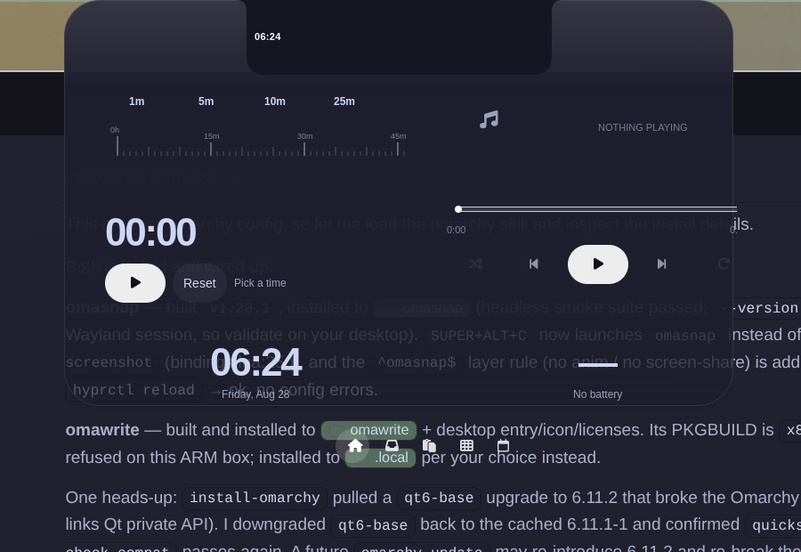
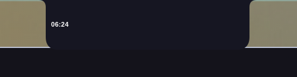
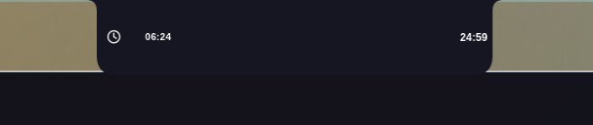
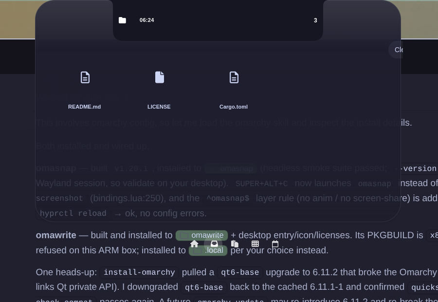
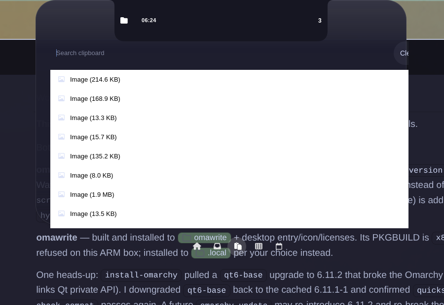
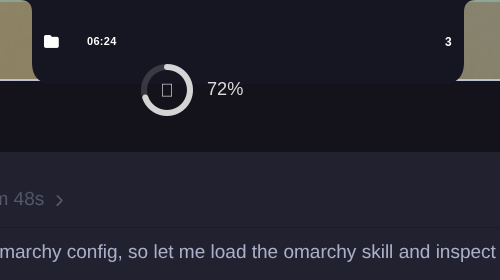

# Naarchy

Your notch is a shelf, a clipboard, a player, and a HUD.

Native GTK4 on Omarchy / Hyprland. MIT. Not Electron.

Drop a file on the island. Copy something, Super+V, it's still there. Hover the
top edge and a glass capsule grows out of the notch. That's the whole product.



<p align="center">
  
  
</p>





## Install

```bash
sudo pacman -S --needed gtk4 gtk4-layer-shell rust
cargo install --path . --locked
```

Then either:

```bash
# recommended
mkdir -p ~/.config/systemd/user
cp contrib/naarchy.service ~/.config/systemd/user/
# cargo-install: set ExecStart=%h/.cargo/bin/naarchy run in that file
systemctl --user daemon-reload
systemctl --user enable --now naarchy.service
```

or, for a one-shot from a terminal:

```bash
naarchy run
```

Full deps, PKGBUILD, Asahi notch keys, and troubleshooting: [docs/INSTALL.md](docs/INSTALL.md).

## First 60 seconds

1. Hover the top-center of the screen. The island opens.
2. `Super+N` toggles it. `Super+V` is clipboard. `Super+Shift+N` is the Inbox.
3. Drop a file on the capsule. Drag it back out into any app.
4. Paste this into Hyprland (or run `naarchy install-binds` and take what you want):

```
exec-once = dbus-update-activation-environment --systemd WAYLAND_DISPLAY DISPLAY XDG_CURRENT_DESKTOP
layerrule = blur, naarchy
layerrule = ignorealpha 0.2, naarchy
```

Pick **one** autostart: systemd **or** the desktop file. Not both. Not `exec-once = naarchy`.

## What you get

- **Island / notch pill** — clock, battery, live activities (timer, now-playing, file count).
- **Home** — timer and media widgets. Pin clock/battery from Widgets.
- **Inbox** — file shelf. Persists. Drags out.
- **Clipboard** — history, search, pin. Click to re-copy.
- **Calendar** — month + today's agenda. Optional ICS feeds.
- **HUDs** — `naarchy hud volume auto` from your volume binds.

Physical notch (Asahi): `notch_mode = true` in `~/.config/naarchy/config.toml`.

## Config

`~/.config/naarchy/config.toml` hot-reloads colors and sizes. Changing monitor
selection or feature flags needs a restart.

Reference: [docs/CONFIG.md](docs/CONFIG.md) · CLI: [docs/CLI.md](docs/CLI.md) ·
Theming: [docs/THEMING.md](docs/THEMING.md).

Naarchy follows the active Omarchy theme unless you override it.

## Clicks

The expanded glass only takes clicks on the capsule and the dock. Everything
else at the top of the screen stays yours. That is not a slogan. It is
`set_input_region`.

## Privacy

No telemetry. Network is album art URLs your player already published, plus ICS
feeds you listed. Socket is `$XDG_RUNTIME_DIR/naarchy.sock`, mode 600.

## License

MIT. Copyright 2026 Michael C Hurley.

Honest matrix vs Droppy / NotchNook / Boring.Notch: [docs/COMPARISON.md](docs/COMPARISON.md).
Spec: [docs/SPEC.md](docs/SPEC.md).
