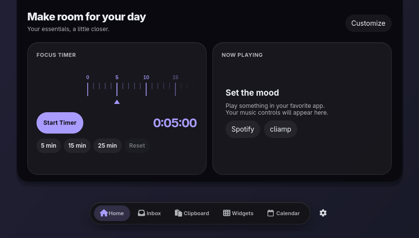
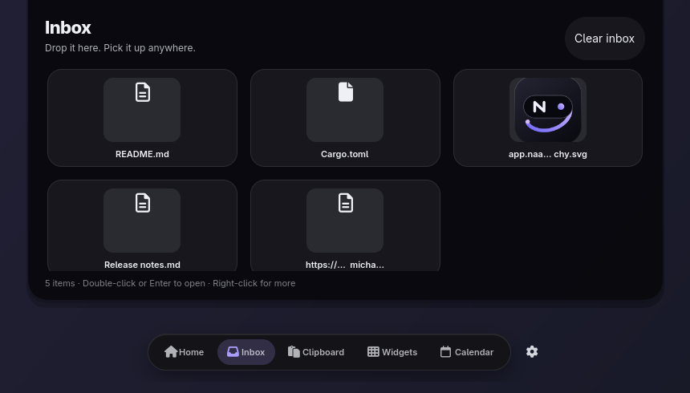
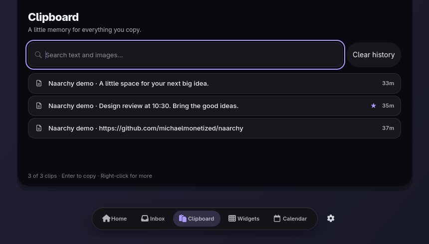

# Naarchy

A little space for everything you are doing.

Naarchy brings a file shelf, clipboard history, music controls, a focus timer,
and your calendar to the top of your Linux desktop. Drop something in, get back
to work, and pick it up when you need it.

Built with Rust and GTK4 for Omarchy and Hyprland. Free software, licensed under MIT.



*The 0.4 interface, captured on Hyprland with demonstration content.*

## Your everyday essentials

- **Inbox.** Park files, images, and text. Open or reveal files, copy paths, pin
  the things you keep reaching for, and drag files back into another application.
- **Clipboard.** Search text and image history, copy an item again, pin favorites,
  and clear everything you have not pinned. History survives a restart.
- **Focus.** Set a countdown from Home or the command line. Pause and resume it;
  a visual bell and repeating sound announce the finish.
- **Music.** See your current MPRIS player, album art, and transport controls.
  When nothing is playing, launch Spotify or cliamp from Home.
- **Calendar.** Browse the month and add ICS feeds for your agenda. Open meeting
  links and directions. Travel estimates are optional.
- **Make it yours.** Choose your Home widgets, follow your Omarchy colors, and
  adjust the island's size and position. Use volume and brightness HUDs from
  your existing desktop bindings.

A physical display notch is optional. Hover and fullscreen detection use Hyprland;
clicking the island and the CLI work on compatible Wayland compositors with layer shell.

| A place to put things | Find that thing you copied |
|---|---|
|  |  |

## Get started

On Arch Linux or Omarchy, install the build dependencies and build the source:

```bash
sudo pacman -S --needed base-devel gtk4 gtk4-layer-shell rust
git clone https://github.com/michaelmonetized/naarchy.git
cd naarchy
cargo install --path . --locked
~/.cargo/bin/naarchy run
```

Rust **1.92 or newer** is required. Run inside your Wayland desktop session.

Prebuilt ARM64 and x86-64 Linux packages are available from
[GitHub Releases](https://github.com/michaelmonetized/naarchy/releases/latest).
Install GTK 4.14+ and gtk4-layer-shell 1.0+, verify `SHA256SUMS`, extract the
package for your architecture, and run `bash scripts/install.sh` inside it.
The installer does not start the service. See the
[installation guide](docs/INSTALL.md#release-artifacts-and-arch-packaging).

Click the island to open it, drop a file into Inbox, and try a short timer:

```bash
naarchy timer 10s
naarchy tab clipboard
naarchy doctor
```

To install the supplied keyboard shortcuts, review `naarchy install-binds` and
copy the bindings you want into your Hyprland configuration. The suggested
shortcuts are `Super+N` for the panel, `Super+Shift+N` for Inbox, and `Super+V`
for Clipboard; they take effect after you add the bindings.

For reliable autostart after a source installation:

```bash
mkdir -p ~/.config/systemd/user
sed 's|ExecStart=/usr/bin/naarchy run|ExecStart=%h/.cargo/bin/naarchy run|' \
  contrib/naarchy.service > ~/.config/systemd/user/naarchy.service
dbus-update-activation-environment --systemd WAYLAND_DISPLAY DISPLAY XDG_CURRENT_DESKTOP
systemctl --user daemon-reload
systemctl --user enable --now naarchy.service
```

[Installation and troubleshooting](docs/INSTALL.md) covers optional dependencies,
other installation methods, compositor setup, updates, and removal.

## Preferences and privacy

The settings button opens native Preferences for appearance, motion, behavior,
and feature controls. Advanced settings are available in
`~/.config/naarchy/config.toml`. Appearance changes reload while Naarchy is
running. Restart after changing service feature flags or calendar feeds. Home
widget choices are saved separately.

A fresh first start on local October 10 gets a brief binary-confetti welcome.
On October 31 the island occasionally wears fangs, cartoon drips, or a bat.
Both respect Reduce motion; Halloween costumes can be disabled in Preferences.
See [seasonal details](docs/CONFIG.md#seasonal-details) for timing and first-run
behavior.

Clipboard and shelf content stay on your machine. Their state and image files
are saved with owner-only permissions. Clipboard history is **not encrypted**;
anything you copy can enter history while capture is enabled. Disable the
Clipboard feature to stop capture, and clear unpinned history from its page.
Parked files are references to the originals; clearing Inbox does not delete them.

Naarchy has no telemetry. Network access is used for your configured calendar
feeds, artwork URLs supplied by media players, and optional travel estimates.
When enabled, travel estimates send event addresses to OpenStreetMap's Nominatim,
request approximate location from IPinfo (with ipapi.co as a fallback), and send route coordinates to OSRM.
Directions and meeting buttons open the relevant site only when selected.
Private calendar feed URLs are credentials: keep your configuration private.

## Learn more

[Configuration](docs/CONFIG.md) · [CLI reference](docs/CLI.md) ·
[Theming](docs/THEMING.md) · [Product scope](docs/COMPARISON.md) ·
[Validation](docs/VALIDATION.md) · [Changelog](CHANGELOG.md) · [Contributing](CONTRIBUTING.md)

Linux is the supported platform. Naarchy does not currently provide every feature
of macOS notch applications; the product scope lists the boundaries explicitly.
