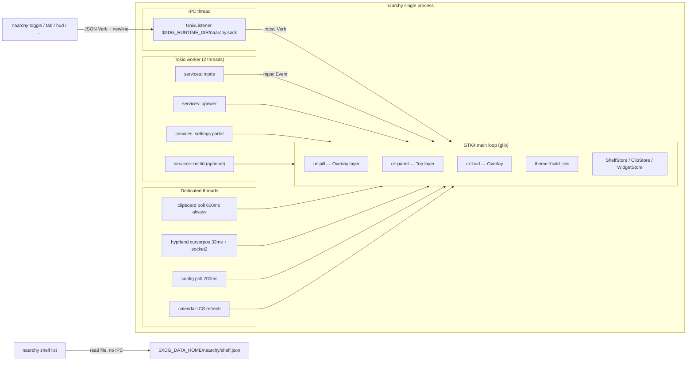
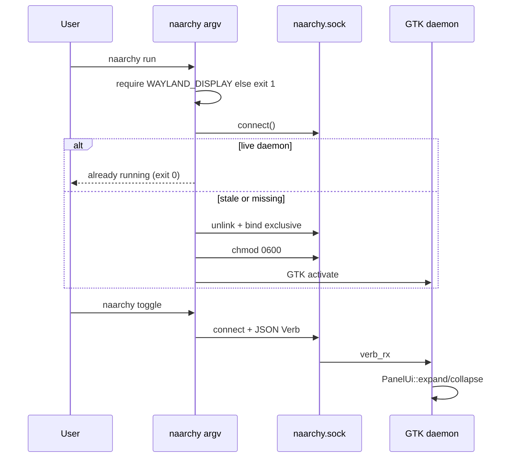

# Naarchy v0.1 — GTM-ready completion

| Field | Value |
|---|---|
| **Author** | Michael C Hurley / agent |
| **Date** | 2026-08-27 |
| **Status** | Draft |
| **Product** | `naarchy` 0.1.0 (Rust 2021, `rust-version` 1.85) |
| **Repo** | https://github.com/michaelmonetized/naarchy |
| **License intent** | MIT (`Cargo.toml`); file not yet in tree |
| **Git** | Initialized, **zero commits**, all files untracked (including `Cargo.lock`) |

This is not a rewrite. The binary already runs: Rust + GTK4 + `gtk4-layer-shell` Wayland overlay for Omarchy/Hyprland, with a liquid-capsule expand that landed after `docs/SPEC.md` was written. The gap is GTM: a stranger who already decided to use it can install it, understand it, and use it in one sitting — and every public sentence matches the binary.

---

## Overview

Naarchy turns the wasted strip at the top of the display — a physical notch on Asahi/Omarchy MacBooks, or a floating Dynamic Island pill on any other monitor — into a productivity layer: file shelf, clipboard history, media, live activities, HUDs, notifications. FOSS, MIT, native. Not Electron.

v0.1 is a working prototype in a dirty tree. The UI contract in code is **Home · Inbox · Clipboard · Widgets · Calendar**. Timer and Media are Home widgets, not tabs. Omarchy theme follow exists. Liquid springs exist. User-facing docs, LICENSE, packaging, single-instance, and an honest competitive matrix do not.

This design closes that gap by (0) committing the dirty tree including `Cargo.lock`, (1) rewriting SPEC/COMPARISON so they describe the binary that exists *today*, (2) landing GTM blockers in code (exclusive daemon lock with already-running **exit 0**, socket mode 600, CLI/bind name alignment, notifications default off, monitor connector, right-click menus, color-scheme map), (3) shipping install artifacts, (4) filling the tests the spec already promised, (5) writing onboarding docs, then tagging `v0.1.0`. Screenshots recapture after the tag.

v0.2 roadmap items stay roadmap. No liquid-UI rewrite. No portal GlobalShortcuts. No in-panel Settings GUI. No IPC reply protocol.

---

## Background & Motivation

### Current state (tree, 2026-08-27)

Single binary crate, **~8k lines** of Rust (7955), 32 source files under `src/`. `cargo test --bins` is **15 passed / 0 failed** today (`chime`, `calendar` ICS parse, `timefmt`, `ui::liquid` geom, `ui::motion` springs, `widget_store` in-memory). Spec §9 also promised config parse, shelf store roundtrip, and clipboard ring: those tests are not there.

| Path | Role |
|---|---|
| `src/main.rs` | CLI dispatcher, unix-socket IPC, tokio services thread, GTK `ApplicationFlags::NON_UNIQUE` |
| `src/app.rs` | Per-monitor pill + panel + HUD, event/verb pump, 1s tick |
| `src/config.rs` | TOML + 700 ms poll hot-reload + default file writer |
| `src/omarchy.rs` | `$XDG_STATE_HOME/omarchy/current/theme.name` + `~/.config/omarchy/themes/<slug>/colors.toml` + terminal font discovery |
| `src/theme.rs` | Generated CSS from config + omarchy palette |
| `src/ui/pill.rs` | Top-center capsule, live-activity bubbles (timer/media/files), spring width, concave-ear notch silhouette |
| `src/ui/panel.rs` | Expanded glass capsule + floating dock, tabs Home/Inbox/Clipboard/Widgets/Calendar |
| `src/ui/liquid.rs` | Capsule geometry + cairo glass + `set_input_region` |
| `src/ui/motion.rs` | Damped springs `OPEN` / `CLOSE` / `SNAP` |
| `src/ui/home.rs` | Widget grid from `WidgetStore`, drop of `text/x-naarchy-widget` |
| `src/ui/drawer.rs` | Widget picker |
| `src/ui/shelfview.rs` | Inbox / file shelf |
| `src/ui/clipview.rs` | Clipboard history |
| `src/ui/{calendar,media,timer,hud}.rs` | Remaining pages / overlays |
| `src/services/{mpris,upower,notifd,settings,hyprland,clipboard,calendar}.rs` | Tokio/thread backends |
| `src/{shelf_store,clip_store,widget_store}.rs` | Persistence |
| `docs/SPEC.md`, `docs/COMPARISON.md` | **Stale.** Written for Media · Shelf · Clipboard · Calendar · Timer · Settings-lite |
| `docs/screenshots/01-pill.png`, `01-pill-collapsed.png` | Full-desktop grim captures (2026-08-26) of an Omarchy session; they do not show the liquid capsule as a product shot |
| `README.md`, `LICENSE`, `CHANGELOG.md`, `contrib/` | **Missing.** `Cargo.toml` still says `readme = "README.md"` |
| `Cargo.lock` | Present, untracked. Required for `--locked` installs. Must land in PR 0. |

### Pain

A user who clones the repo cannot: read a README, find a license, install a unit, autostart, or trust SPEC/COMPARISON. `naarchy install-binds` still prints `naarchy tab shelf` while `--help` lists `inbox`. A second `naarchy run` can start a second GTK app because bind failure is a warning (`src/main.rs` ~242–244) and the app is `NON_UNIQUE`. Socket is not `chmod 600`. Omarchy already has mako; default `features.notifications = true` will fight it if naarchy wins the name race. `cargo install --path . --locked` cannot work until `Cargo.lock` is committed.

That is not GTM. That is a laptop project.

---

## Goals & Non-Goals

### Goals (v0.1 GTM)

A stranger on Omarchy/Hyprland, in one sitting:

1. Installs from source (and, with the in-tree PKGBUILD, from AUR if someone publishes it) with listed system deps.
2. Autostarts via **either** systemd user unit **or** XDG desktop autostart — not both. INSTALL picks one per install path (systemd for cargo-install; packaged unit for PKGBUILD).
3. Reads a README that onboards: what it is, install, first 60 seconds, hover/click, tabs, HUDs, config path, Hyprland blur, "don't steal clicks", privacy.
4. Finds a complete config reference, CLI reference, and theming notes.
5. Trusts SPEC and COMPARISON because they match the tagged binary.
6. Knows what is v0.1 vs later (Floating Basket, TermiNotch, plugins stay roadmap).
7. `cargo test` / clippy / fmt pass; a smoke script exists.
8. `LICENSE` is in the tree.

### Non-goals (explicit)

- v0.2 items in current SPEC §8: Floating Basket, VTE TermiNotch, Power Folders, OCR, LocalSend, visualizer, lyrics, whisper, keystroke sounds, hyprlock, plugins, per-workspace shelves.
- Rewriting the liquid UI.
- Electron, X11-native path, macOS port.
- Telemetry, accounts, a marketing site beyond README.
- `xdg-desktop-portal` GlobalShortcuts (CLI is the path; document it).
- Settings GUI inside the panel (config.toml is the path; document it).
- User CSS override file (spec S7 mentioned it; code never grew it; do not invent it).
- SHA-256 album-art keys (spec promised; code uses `DefaultHasher`; keep it, document it).
- Migrating `widgets.json` out of the config dir on existing testers.
- Fake screenshots.
- An IPC reply protocol. Queries that can read a file, read the file.

### In-scope code (GTM blockers — all land **before** `v0.1.0`)

Small, real, already-half-there. None of these wait for a post-tag polish PR:

- Exclusive `naarchy run`; live daemon → **exit 0** (idempotent `systemctl start`); verbs still forward.
- Socket mode 600. Stale socket from `quit` is unlinked on the next connect-fail.
- `WAYLAND_DISPLAY` required in `start_daemon`; unset → stderr + exit 1 (no silent systemd skip).
- `install-binds` + help use the real tab names; keep cheap aliases (`shelf` → Inbox).
- `shelf add` parser requires a path (`rest.len() > 1`). `shelf list` is client-side JSON. `shelf clear` / `shelf remove ID` / `timer stop` are fire-and-forget verbs.
- Notifications default **off** in `Features::default` and the written default file (Open Question 1: Michael can override; the design proceeds with off). Existing user `config.toml` is not rewritten.
- Monitor-name filter reads `gdk::Monitor::connector()`; empty connector always wants.
- Context menus on button 3 (right-click), not triple-click.
- Color-scheme portal mapping (fallback when omarchy palette is missing or `omarchy = false`).
- LICENSE, desktop file, systemd unit, PKGBUILD, Hyprland snippet.
- Tests the spec already listed.
- Honest screenshot recapture *after the tag* (execute when a display is available; do not generate images).

---

## Proposed Design

### Product contract (the UI that ships)

Canonical tab rail, from `src/ui/mod.rs` `Tab` and `src/ui/panel.rs` dock:

| Dock | Stack name | Feature flag | CLI canonical | Aliases already in `TabStr` (`src/app.rs`) |
|---|---|---|---|---|
| Home | `home` | always | `home` | `start` |
| Inbox | `inbox` | `features.shelf` | `inbox` | `files`, `shelf`, `drops` |
| Clipboard | `clip` | `features.clipboard` | `clipboard` | `clip` |
| Widgets | `widgets` | always | `widgets` | `drawer`, `grid` |
| Calendar | `cal` | `features.calendar` | `calendar` | `cal` |

**Timer** and **Media** are Home widgets (`WidgetKind::{Timer, Media}`), default-on in `WidgetStore::default()`. Clock can be pinned from the Widgets drawer. There is no Settings tab. There is no Media tab. There is no Timer tab. There is no Battery widget.

`features.media` / `features.timer` hide **pill live-activity chips** (`src/ui/pill.rs` mood gating). They do **not** remove the Home widgets. `features.shelf` / `features.clipboard` / `features.calendar` hide the corresponding dock items. Home and Widgets dock items are always present.

Live-activity bubbles on the collapsed pill (`src/ui/pill.rs` `Mood`), one pair at a time: timer-done > running timer > media > files count.

Motion: panel expand/collapse is `ui::motion::Spring::{OPEN,CLOSE}` driving `ui::liquid::geom` + cairo glass. Pill width is `Spring::SNAP`. HUD value/opacity is `SNAP`. Content fades in after ~40% open (`content_opacity`); dock lags (`dock_opacity`). This is the liquid-capsule overhaul. SPEC must describe it. SPEC must stop talking about a tab rail of Media · Shelf · Timer · Settings-lite.

### Architecture (as built)



Facts SPEC currently gets wrong and must stop getting wrong:

- There is no `ui::shell`. Surfaces are `PillUi` + `PanelUi` + `HudManager`.
- There is no `state.toml`. Last tab is in-memory (`Shared.tab`), default Home, not persisted.
- Persistence is split: data dir for shelf/clipboard, **config dir** for widgets.
- Keyboard mode is `OnDemand` on every layer surface, including the collapsed pill (`ui::setup_layer_with`).
- Exclusive zone is `-1` (do not reserve).
- Layer namespace is `"naarchy"` — that is the Hyprland `layerrule` target.
- Album-art network is `ureq` inside `services::mpris::resolve_art` (connect 4s, total 8s, 24 MB cap), keyed by `util::cache_key` (`DefaultHasher`), stored under `$XDG_CACHE_HOME/naarchy/art/`.
- Calendar ICS is a **second** network path (`services::calendar::fetch`, 20s timeout). Privacy copy must mention it.
- Clipboard poll is **always on** (`main.rs` always `services::clipboard::spawn`). `features.clipboard` only hides the dock item. Do not gate the poll in v0.1; document it.

### Single-instance (blocker)

Today (`src/main.rs` `start_daemon`):

```rust
let _ = std::fs::remove_file(&path);
if let Ok(listener) = UnixListener::bind(&path) { /* spawn */ }
else { log::warn!("could not bind IPC socket at {:?}", path); }
// GTK still runs — ApplicationFlags::NON_UNIQUE
```

Two `naarchy run` processes can paint two pills. Verbs attach to whichever bound last.

Target:



Rules:

1. Keep `ApplicationFlags::NON_UNIQUE`. CLI verbs are a **separate process**; GTK unique-app would fight that. The lock is the socket, not Gio.
2. `naarchy run` / `daemon` / no-args: if `WAYLAND_DISPLAY` is unset, print `naarchy: WAYLAND_DISPLAY is unset; start from a Wayland session` and exit 1.
3. Then try `UnixStream::connect`. If it succeeds, print `naarchy already running` and **exit 0**. Do not forward `run` as a Verb. Exit 0 makes `systemctl --user start naarchy` idempotent and prevents a `Restart=` storm when desktop autostart, leftover `exec-once`, or a terminal daemon already holds the socket.
4. If connect fails (ENOENT / ECONNREFUSED): `remove_file`, `bind`. Bind failure is fatal (exit 1), not a warning.
5. After bind: `Permissions::from_mode(0o600)`.
6. On GTK shutdown the existing `remove_file(sock_path())` stays.
7. `Verb::Quit` is `process::exit(0)` and **skips** the post-`gtk_app.run()` unlink. That can leave a stale socket. The connect-fail → unlink dance in the next `run` cleans it. Do not "fix" `quit` to return from `run` and then double the unlink logic.
8. Verbs (`toggle`, `tab`, `hud`, `shelf add|clear|remove`, `timer`, …) keep today's path: parse → connect → write JSON line → exit. Connect failure: `naarchy daemon not running (start with: naarchy run)` exit 1. **`shelf list` does not use this path.**

No flock file. The exclusive unix bind is the lock. YAGNI. No reply bytes on the socket. Ever, in v0.1.

### CLI contract (help must match `verb_from_args` + `TabStr`)

Shipped verbs, from `src/main.rs`, plus the GTM additions:

| Verb | Args | IPC? | Notes |
|---|---|---|---|
| `run` / `daemon` / (none) | — | bind | Start daemon. Live daemon → exit 0. |
| `toggle` | — | fire-and-forget | Expand/collapse |
| `expand` / `collapse` | — | fire-and-forget | |
| `tab` | `home\|inbox\|clipboard\|widgets\|calendar` | fire-and-forget | Aliases: see table above. Unknown tab is silently ignored today (`TabStr` Err → no-op). **Change:** print error, exit 2. `naarchy tab` with no name already exits 2 — keep it. |
| `hud` | `volume\|brightness\|mic\|battery\|caps\|custom` `[value\|+N\|-N]` `[--icon GLYPH] [--label TEXT]` | fire-and-forget | If no value/step, `detect_value` shells out to pamixer/wpctl, brightnessctl, `/sys/class/power_supply`. **`"auto"` is not a parser token.** `install-binds` passes `auto`; the parser ignores it as a non-number, then `detect_value` runs because value and step are both none. Document that in CLI.md. |
| `notify` | `SUMMARY [BODY]` | fire-and-forget | Always paints a banner via `HudManager::show_banner`. Does **not** require owning `org.freedesktop.Notifications`. |
| `shelf add` | `PATH…` | fire-and-forget | Parser today: `Some("add") if !rest.is_empty()` treats `["add"]` as `ShelfAdd([])`. **Fix:** `rest.len() > 1`. `http…` stored as text; else file. |
| `shelf list` | — | **none** | Client reads `$XDG_DATA_HOME/naarchy/shelf.json`. See below. |
| `shelf clear` | — | fire-and-forget | New `Verb::ShelfClear`. Store already has `clear()`. |
| `shelf remove` | `ID` | fire-and-forget | New `Verb::ShelfRemove(String)`. |
| `clipboard paste-last` | alias `clip`, `copy-last` | fire-and-forget | Re-copies newest entry via `wl-clipboard-rs` |
| `timer` | `30s\|25m\|1h` | fire-and-forget | `parse_duration`: `s/sec/secs`, `m/min/mins`, `h/hr/hour/hours`, bare number = seconds. |
| `timer stop` | — | fire-and-forget | New `Verb::TimerStop` (do not overload `Timer(0)`). UI Reset already clears `Shared.timer`. |
| `quit` | — | fire-and-forget | `process::exit(0)`; may leave a stale socket (rule 7). |
| `install-binds` | — | none | Prints Hyprland snippet to stdout. **Fix:** `tab inbox` not `tab shelf`; include `dbus-update-activation-environment`; mention the systemd unit path. |

`install-binds` `tab shelf` already *works* because of the alias. That is not a reason to print the alias. Canonical name in generated binds = dock label's CLI name.

#### `shelf list` (no IPC)

`persist()` writes `shelf.json` via tmp+rename on every mutation. The file is the source of truth. Do not invent a reply protocol.

```
naarchy shelf list
```

1. Open `$XDG_DATA_HOME/naarchy/shelf.json` (`dirs::data_dir()/naarchy/shelf.json`, same as `util::data_dir()`).
2. Stdout: **one JSON array of `ShelfItem`**, pretty-printed, same schema as the file. Missing or empty file → `[]` plus newline, exit 0.
3. Unreadable JSON → stderr `naarchy: could not read shelf.json`, exit 1.
4. Does not require the daemon. Does not connect to the socket. Does not create the file.

Example:

```json
[
  {
    "id": "a1b2c3d4e5f60708",
    "kind": "file",
    "name": "shot.png",
    "path": "/home/m/Pictures/shot.png",
    "mime": "image/png",
    "text": "",
    "data_ref": "",
    "added_at": 1756200000,
    "pinned": false
  }
]
```

Mutations (`add` / `clear` / `remove`) still go to the daemon so the live `ShelfStore` and the UI refresh. `list` after a mutation that the daemon persisted will see the new file; a `list` racing `persist()` sees either the previous complete JSON or the new complete JSON (atomic rename).

### Input region (design principle, keep)

`ui::liquid::apply_input_region` unions the capsule rect + dock widget rect onto the panel's wl surface. On collapse it `clear_input_region`s. Empty glass around the capsule must never eat clicks. Document this in README and SPEC as principle #2. Do not regress it.

The **pill** window does not set an input region (`pill.rs` has no `apply_input_region`). That is acceptable: the pill window *is* the capsule (width springs to content). Document: click-through applies to the expanded panel; the collapsed pill is the hit target.

Hover-open on Hyprland is compositor-assisted: `cursorpos` at ~30 Hz (`services/hyprland.rs`, 33 ms sleep), full-width band (`x` is unused), dwell `hover_ms` (default 180). Non-Hyprland: click the pill or CLI. Spec already said this; keep it.

Drag-over auto-open is the **panel** `DropTarget::connect_enter` (`src/ui/panel.rs`), not a pill DropTarget (`pill.rs` has none). On Hyprland, dragging toward the top edge also trips the hover band, which expands the panel, which then accepts the drop. **Non-Hyprland: drag onto the collapsed pill does not expand.** COMPARISON/SPEC: ⚠️ platform note, same class as hover. Shelf **drag-out** of parked tiles stays ✅ (`DragSource` on tiles, `src/ui/shelfview.rs`).

### Notifications vs mako (proceed with default off)

`features.notifications` (default **true** in `Features::default` and the written `config.toml` today) tries to `request_name("org.freedesktop.Notifications")`. If mako/dunst already owns it, `notifd::run` returns Err, logs `another notification daemon owns …; banners disabled`, and `naarchy notify` still works because `Verb::Notify` paints directly.

If naarchy starts first, **mako is starved**. Omarchy ships a notification surface. GTM default must not pick that fight.

**Decision the design implements:** default `notifications = false`. Flip both `Features::default` and the written default file in the **daemon-lock PR** (PR 2), not after the tag. Written comment: `# own org.freedesktop.Notifications (keep false to leave mako/dunst alone)`. Users who want notch banners flip one key. `naarchy notify` and timer-done banners stay.

**Existing tester `config.toml` is not rewritten.** If a tester already has `notifications = true`, serde keeps it. `#[serde(default)]` only fills a *missing* key. INSTALL troubleshooting must say: new installs default off; if you wrote `true` during prototyping, edit the file or you still own the name.

Open Question 1 remains for Michael to confirm. Implementation proceeds with off. If he answers on, revert the two flips before tag — do not ship a SPEC sentence that disagrees with the binary.

### Persistence layout (document, do not churn)

```
$XDG_CONFIG_HOME/naarchy/config.toml     # hot-reloaded, 700 ms content-equality poll
$XDG_CONFIG_HOME/naarchy/widgets.json    # Home widget set (preference, not content)
$XDG_DATA_HOME/naarchy/shelf.json
$XDG_DATA_HOME/naarchy/clipboard.json
$XDG_DATA_HOME/naarchy/blobs/            # shelf PNG drops + clipboard image blobs
$XDG_CACHE_HOME/naarchy/art/             # MPRIS album art
$XDG_CACHE_HOME/naarchy/calendar/feed-N.ics
$XDG_CACHE_HOME/naarchy/chime.wav
$XDG_RUNTIME_DIR/naarchy.sock            # mode 600 after this work
```

`dirs` crate: `data_dir()` → `~/.local/share/naarchy`, `config_dir()` → `~/.config/naarchy`.

**Do not move `widgets.json`.** It is layout preference. Moving it forces a migration on testers for no user-visible win. Document the split. This is a Key Decision, not an open question.

Old SPEC `state.toml` (last tab, geometry): does not exist. Do not add it. Last tab lives until process exit. Panel size is config.

Hot-reload (`ConfigWatcher`): every 700 ms, compare file **contents as a string** to the last contents (not a hash, not mtime). On change, `Event::ConfigChanged` → `Shared.cfg` + `restyle()` + `panel.redraw()`. **It does not rebuild surfaces.** Changing `behavior.monitors` or dock-hiding feature flags requires a restart. Document that in CONFIG.md or people will file "hot-reload is broken."

### Data formats (actual structs)

Shelf item (`src/shelf_store.rs` `ShelfItem`):

```json
{
  "id": "016-hex DefaultHasher(now, pid)",
  "kind": "file|text|image",
  "name": "shot.png",
  "path": "/home/m/Pictures/shot.png",
  "mime": "image/png",
  "text": "",
  "data_ref": "",
  "added_at": 1756200000,
  "pinned": false
}
```

Text keeps `text`. Image-without-file writes PNG under `blobs/img-<cache_key>.png` and stores that as `path`. Dead file entries are dropped on load.

Clipboard (`src/services/mod.rs` `ClipEntry` + `ClipKind`):

```json
{
  "id": "…",
  "kind": "Text|Image",
  "mime": "text/plain;charset=utf-8",
  "preview": "first 80 chars",
  "text": "full text or empty",
  "data_ref": "clip-<key>.bin",
  "at": 1756200000,
  "pinned": false
}
```

Pins sort first. Unpinned trimmed to `clipboard.max_entries` (200). Images skipped above `max_image_bytes` (8 MiB). Watcher polls Wayland clipboard every 600 ms for `image/png` then `text/plain`; URIs arrive as text if the source offers text. There is **no** distinct URI kind.

### Theming

`theme::resolve` + `omarchy::palette`:

- `appearance.omarchy = true` (default) reads accent/background/dark_background/foreground from the active omarchy `colors.toml`.
- `appearance.accent = None` follows omarchy; a hardcoded `#7aa2f7` is stripped in `Config::normalize` so old files don't pin Tokyo-night blue.
- `appearance.theme = "auto"` uses omarchy `mode` when a palette is found (`theme.rs` `resolve`: `_ => om.mode != "light"`). The xdg-desktop-portal `color-scheme` flag (`services/settings.rs` → `Event::SchemeDark`) is the **fallback** when the omarchy palette cannot be read or `omarchy = false`. It is not what paints the island on a stock Omarchy box.
- Icon font: config override, else foot/ghostty/kitty/alacritty discovery, else `"JetBrainsMono Nerd Font"`.
- CSS is generated into a `CssProvider` at `STYLE_PROVIDER_PRIORITY_APPLICATION`, scoped to `window.naarchy`. No user CSS file.
- Hyprland blur is compositor-side: `layerrule = blur, naarchy` + `ignorealpha 0.2`. The cairo capsule already fades alpha at the bottom so blur reads as liquid.

Dead CSS: `.na-tabbar` / `.na-tab` in `theme.rs` are leftover from the old tab rail. Safe to delete in the screenshot/docs-follow-up PR; not a tag blocker.

### Packaging

New tree (after PR 0 + later PRs):

```
contrib/naarchy.desktop
contrib/naarchy.service
contrib/PKGBUILD
contrib/hyprland.conf
scripts/smoke.sh
.github/workflows/ci.yml
LICENSE
README.md
CHANGELOG.md
CONTRIBUTING.md
docs/{SPEC,COMPARISON,INSTALL,CONFIG,CLI,THEMING}.md
```

No Makefile. `cargo install --path . --locked` and the PKGBUILD are enough. YAGNI.

**Desktop** (`contrib/naarchy.desktop`) — packaged path (`PATH` includes `/usr/bin`):

```ini
[Desktop Entry]
Type=Application
Name=Naarchy
Comment=Notch island — file shelf, clipboard, media, HUDs
Exec=naarchy run
TryExec=naarchy
Terminal=false
Categories=Utility;
StartupNotify=false
X-GNOME-Autostart-enabled=true
Keywords=notch;island;clipboard;shelf;hyprland;omarchy;
```

No icon asset in v0.1. Do not invent a PNG. `Icon=` omitted.

Do **not** enable this as user autostart if the systemd unit is enabled. INSTALL: pick one.

**systemd user unit, packaged** (`contrib/naarchy.service`):

```ini
[Unit]
Description=Naarchy notch island
PartOf=graphical-session.target
After=graphical-session.target

[Service]
ExecStart=/usr/bin/naarchy run
Restart=on-abnormal
RestartSec=2

[Install]
WantedBy=graphical-session.target
```

No `ConditionEnvironment=WAYLAND_DISPLAY`. If the compositor env never reached the user manager, `start_daemon` fails loudly (exit 1) instead of the unit sitting `inactive (dead)` with no log. Hyprland snippet imports the env (below).

`Restart=on-abnormal` (signal, unclean) — not `on-failure`. Combined with already-running **exit 0**, a second start does not 2s-loop.

**cargo-install snippet** (INSTALL.md + comment in the same unit file):

```ini
# After: cargo install --path . --locked
# copy this file to ~/.config/systemd/user/naarchy.service and set:
ExecStart=%h/.cargo/bin/naarchy run
```

`%h` is systemd-expanded. Desktop files do **not** expand `%h`; source-first GTM autostart is the systemd unit, not XDG desktop autostart.

PKGBUILD installs the packaged unit (`ExecStart=/usr/bin/naarchy run`) to `/usr/lib/systemd/user/naarchy.service`.

**PKGBUILD** (`contrib/PKGBUILD`) — complete template. `source=` / `sha256sums` stay commented until the GitHub repo and `v0.1.0` tag exist. `makepkg` is tag-only. GitHub tarballs extract to `$pkgname-$pkgver/`; every function `cd`s there. `LICENSE` lands in **PR 3** with this file (MIT text, no behavior) so `package()` can always install it.

```bash
# Maintainer: Michael C Hurley <michaelmonetized@gmail.com>
pkgname=naarchy
pkgver=0.1.0
pkgrel=1
pkgdesc="Notch / dynamic-island overlay for Omarchy and Hyprland"
arch=('x86_64' 'aarch64')
# Uncomment after https://github.com/michaelmcdONALD/naarchy exists and v$pkgver is tagged:
# url="https://github.com/michaelmcdONALD/naarchy"
license=('MIT')
depends=(gtk4 gtk4-layer-shell)
optdepends=(
  'pamixer: volume HUD auto-detect'
  'brightnessctl: brightness HUD auto-detect'
  'pipewire-audio: timer chime via pw-play'
  'ttf-jetbrains-mono-nerd: default dock glyphs'
)
makedepends=(cargo)
options=(!lto)  # Cargo.toml already sets lto = "thin"; pacman LTO double-applies
# source=("$pkgname-$pkgver.tar.gz::https://github.com/michaelmcdONALD/naarchy/archive/refs/tags/v$pkgver.tar.gz")
# sha256sums=('SKIP')

prepare() {
  cd "$pkgname-$pkgver"
  export RUSTUP_TOOLCHAIN=stable
  cargo fetch --locked --target "$CARCH-unknown-linux-gnu"
}

build() {
  cd "$pkgname-$pkgver"
  export RUSTUP_TOOLCHAIN=stable
  export CARGO_TARGET_DIR=target
  cargo build --frozen --release
}

package() {
  cd "$pkgname-$pkgver"
  install -Dm755 "target/release/naarchy" "$pkgdir/usr/bin/naarchy"
  install -Dm644 "contrib/naarchy.desktop" "$pkgdir/usr/share/applications/naarchy.desktop"
  install -Dm644 "contrib/naarchy.service" "$pkgdir/usr/lib/systemd/user/naarchy.service"
  install -Dm644 LICENSE "$pkgdir/usr/share/licenses/$pkgname/LICENSE"
  install -Dm644 "contrib/hyprland.conf" "$pkgdir/usr/share/doc/$pkgname/hyprland.conf"
}
```

`--frozen` implies the lockfile; no extra `--locked` on `build()`. v0.1.0 is **source-first**. Do not uncomment `source=` until the GitHub remote exists.

**Hyprland snippet** (`contrib/hyprland.conf`): the same text `install-binds` prints. `print_binds()` is the source of truth; `contrib/hyprland.conf` is a checked-in copy. CI smoke greps both for `tab inbox` and `layerrule = blur, naarchy`.

Must include (so the user systemd manager sees the compositor env):

```
exec-once = dbus-update-activation-environment --systemd WAYLAND_DISPLAY DISPLAY XDG_CURRENT_DESKTOP
```

Must **not** include `exec-once = naarchy run` if INSTALL is sending people to systemd. A commented line is fine: `# autostart: systemd --user, not exec-once (pick one)`.

`print_binds` already mentions `systemctl --user enable --now naarchy.service` as a comment. PR 3 is the *file* behind that comment, plus the `dbus-update-activation-environment` line and `tab inbox`.

### Tests & CI

Binary crate (no `[lib]`). Tests live next to the modules and run via `cargo test --bins` (today: 15).

Add, using **no new crates**:

| Test | Where | How |
|---|---|---|
| Config parse + defaults + `normalize` strips `#7aa2f7` | `src/config.rs` | `from_toml` is already in-module; make it `pub(crate)` if tests in another file need it. Cover unknown keys ignored, `monitors = "primary"`, `monitors = ["DP-1"]`. After PR 2: default `notifications == false`. |
| Shelf store roundtrip | `src/shelf_store.rs` | `ShelfStore::open(dir)` used by `load()` (`data_dir()`). **Per-test dir:** `std::env::temp_dir().join(format!("naarchy-shelf-{}-{}", std::process::id(), unique))` where `unique` is `SystemTime::now().duration_since(UNIX_EPOCH).unwrap().as_nanos()` or an `AtomicU64` counter. `let _ = fs::remove_dir_all(&dir)` at the end, best-effort. PID-only is not enough — `cargo test` shares a PID across threads. File add/dedupe, text add, image blob, pin sort, clear keeps pins, missing files filtered on load. |
| Clipboard ring | `src/clip_store.rs` | Same `open(dir)` seam, **separate** unique dir prefix `naarchy-clip-…`. Dedupe newest, image cap, pin never trimmed, overflow drops oldest unpinned. |
| `parse_duration` | `src/main.rs` `#[cfg(test)]` | `25m` → 1500, `30s`, `1h`, `90` (bare seconds), reject `foo`. |
| `TabStr` | `src/app.rs` | `shelf`/`inbox`/`files` → Inbox; unknown → Err. |
| `verb_from_args` | `src/main.rs` | `hud volume +5`; `shelf add` without path errors (**requires PR 2 parser `rest.len() > 1`**; today's `["add"]` is `Ok(ShelfAdd([]))`). `shelf list` is not a Verb — do not send it to `verb_from_args` as success. |

`WidgetStore` disk I/O stays untested at the filesystem (in-memory roundtrip already exists). Do not add `tempfile`.

**CI** — complete workflow. Keep `ubuntu-24.04`. Noble's `libgtk-4-dev` is GTK **4.14.x**. Today's `Cargo.toml` is `gtk4` feature `v4_16`, which gtk4-sys maps to `pkg-config` gtk4 **>= 4.16** — that will not configure on this runner.

**Drop the crate feature to `v4_14` in PR 4** (`Cargo.toml` + `Cargo.lock`). `Monitor::connector()` is GTK 4.10. Nothing in this tree needs 4.16. Running on a newer GTK (Arch/Omarchy) still works; `v4_14` is the API floor, not a cap.

`libgtk4-layer-shell-dev` is not in Ubuntu 24.04; build the C library from source. Upstream tag is **`v1.0.4`**. Install prefix `/usr` so pkg-config finds `gtk4-layer-shell-0.pc` without extra `PKG_CONFIG_PATH`. Disable introspection/vapi so we do not need gobject-introspection packages.

`.github/workflows/ci.yml`:

```yaml
name: ci
on:
  push:
    branches: [main]
  pull_request:

jobs:
  check:
    runs-on: ubuntu-24.04
    steps:
      - uses: actions/checkout@v4

      - uses: dtolnay/rust-toolchain@master
        with:
          toolchain: 1.85.0
          components: rustfmt, clippy

      - name: apt build deps
        run: |
          sudo apt-get update
          sudo apt-get install -y --no-install-recommends \
            pkg-config meson ninja-build cmake git \
            libgtk-4-dev libwayland-dev wayland-protocols

      - name: gtk4-layer-shell from source
        run: |
          git clone --depth 1 --branch v1.0.4 \
            https://github.com/wmww/gtk4-layer-shell.git /tmp/gtk4-layer-shell
          meson setup /tmp/gtk4-layer-shell/build /tmp/gtk4-layer-shell \
            --prefix=/usr \
            -Dexamples=false -Ddocs=false -Dtests=false \
            -Dintrospection=false -Dvapi=false
          ninja -C /tmp/gtk4-layer-shell/build
          sudo ninja -C /tmp/gtk4-layer-shell/build install
          sudo ldconfig

      - run: cargo fmt --check
      - run: cargo clippy --all-targets -- -D warnings
      - run: cargo test --bins
      - run: cargo build --bins
      - run: bash scripts/smoke.sh
        env:
          BIN: ./target/debug/naarchy
```

Do not pin an unreleased Ubuntu runner to keep `v4_16`. The feature drop is the GTM path.

**`scripts/smoke.sh`** — headless. Shebang, `set -euo pipefail`, explicit `BIN`.

```bash
#!/usr/bin/env bash
set -euo pipefail

BIN="${BIN:-./target/debug/naarchy}"
if [[ ! -x "$BIN" ]]; then
  cargo build --bins
  BIN=./target/debug/naarchy
fi

# --- already green on current tree: keep as regression ---
# help lists the real tabs (grep the tab *usage line* so a later "media widget"
# one-liner cannot false-positive)
tab_line="$("$BIN" --help | grep -E '^  naarchy tab ')"
echo "$tab_line" | grep -F 'home|inbox|clipboard|widgets|calendar'
if echo "$tab_line" | grep -Eq 'media|settings'; then
  echo "help tab line still advertises media/settings" >&2
  exit 1
fi

# naarchy tab (no name) already exits 2
set +e
"$BIN" tab >/dev/null 2>&1
ec=$?
set -e
[[ "$ec" -eq 2 ]]

# naarchy toggle with no socket already exits 1 and prints the hint
set +e
out="$("$BIN" toggle 2>&1)"
ec=$?
set -e
[[ "$ec" -eq 1 ]]
echo "$out" | grep -q 'daemon not running'

# --- added in PR 2; smoke lands in PR 4, which depends on PR 2 ---
# unknown tab → exit 2
set +e
"$BIN" tab nosuch >/dev/null 2>&1
ec=$?
set -e
[[ "$ec" -eq 2 ]]

set +e
"$BIN" tab media >/dev/null 2>&1
ec=$?
set -e
[[ "$ec" -eq 2 ]]

binds="$("$BIN" install-binds)"
echo "$binds" | grep -F 'naarchy tab inbox'
if echo "$binds" | grep -Fq 'tab shelf'; then
  echo "install-binds still prints tab shelf" >&2
  exit 1
fi
echo "$binds" | grep -F 'layerrule = blur, naarchy'
echo "$binds" | grep -F 'dbus-update-activation-environment'
```

Optional grim path, documented in INSTALL, skipped unless `NAARCHY_SMOKE_DISPLAY=1` and `WAYLAND_DISPLAY` is set. Do not fail CI on this.

### Screenshot refresh plan (do not fake)

Existing `docs/screenshots/01-pill.png` and `01-pill-collapsed.png` are 2026-08-26 full-desktop captures of an X/Twitter session under Omarchy waybar. They do not demonstrate the liquid capsule, the dock, or Home widgets. **Do not generate replacement images in this design pass.** Recapture is a **docs-only PR after `v0.1.0`**.

| File | Shot |
|---|---|
| `docs/screenshots/01-island-collapsed.png` | Island pill, clock, idle |
| `docs/screenshots/02-island-media.png` | Playing media, live-activity bubbles |
| `docs/screenshots/03-expanded-home.png` | Liquid capsule, Home with Timer+Media, floating dock |
| `docs/screenshots/04-inbox.png` | Inbox with a few files |
| `docs/screenshots/05-clipboard.png` | Clipboard list + search |
| `docs/screenshots/06-hud-volume.png` | Volume HUD under the pill |

Until recapture: README ships **without** a hero screenshot. Do not caption the current files as the liquid UI.

### Idle budget (honesty)

SPEC §2.5 said "zero CPU when collapsed and idle". The code is not that:

| Source | Period | When |
|---|---|---|
| GTK 1s tick (`app.rs`) | 1 s | Always, collapsed included (clock) |
| Config poll | 700 ms | Always |
| Clipboard poll | 600 ms | **Always today** (`main.rs` always spawns it). Optionally gate on `features.clipboard` later — not required for v0.1. Document the always-on poll. |
| Hyprland `cursorpos` | 33 ms | Collapsed, `hover_open` |
| MPRIS rescan | 1500 ms | Always |
| MPRIS position | 400 ms | While a player is Playing |
| Calendar | `refresh_min` (default 5) | If feeds non-empty |

Keep the numbers as **targets**, not lies. Hover sampler stays; it is the click-through design. Do not rewrite clipboard to `ext-data-control` in v0.1. SPEC v0.1 rewrite: "small polling, event-driven DBus; hover sampler only while collapsed."

RSS target `< 60 MB` stays a target.

---

## API / Interface Changes

### CLI help (before → after)

Before (`src/main.rs` `print_help`): tabs listed correctly; `install-binds` still emits `tab shelf`. `naarchy tab` with no name already exits 2. Unknown *names* do not.

After:

```
naarchy 0.1.0 — notch island for Omarchy/Hyprland

USAGE:
  naarchy run                     launch (foreground)
  naarchy toggle                  expand/collapse
  naarchy expand | collapse
  naarchy tab <home|inbox|clipboard|widgets|calendar>
                                  aliases: start=home, shelf|files|drops=inbox,
                                  clip=clipboard, drawer|grid=widgets, cal=calendar
  naarchy hud <volume|brightness|mic|battery|caps|custom> [value|+N|-N]
                                  [--icon GLYPH] [--label TEXT]
  naarchy notify SUMMARY [BODY]   banner (does not need notifd)
  naarchy shelf add PATH…
  naarchy shelf list              print shelf.json as a JSON array (no daemon)
  naarchy shelf clear | remove ID
  naarchy clipboard paste-last    aliases: clip, copy-last
  naarchy timer <30s|25m|1h> | stop
  naarchy quit
  naarchy install-binds           print recommended hyprland binds
```

Unknown tab: stderr + exit 2 (today: silent no-op). `tab media` is unknown.

### Daemon lock (behavior change)

`naarchy run` while a live socket exists: print `naarchy already running`, **exit 0**, no second GTK app. Bind failure / missing `WAYLAND_DISPLAY`: exit 1.

### Store seams (for tests, no user-visible change)

```rust
impl ShelfStore {
    /// Load the shelf from `$XDG_DATA_HOME/naarchy`.
    pub fn load() -> Self { Self::open(crate::util::data_dir()) }

    /// Load (or create) a shelf rooted at `dir` (`shelf.json` + `blobs/`).
    pub fn open(dir: PathBuf) -> Self { /* existing body */ }
}
```

Same for `ClipStore`. Public primitives get a short docblock (title, what, args, return) per project rules.

### Monitor filter (bugfix — before tag)

Today (`src/app.rs`):

```rust
if !sel.wants("", i == 0) { continue; }
```

`MonitorSel::List` never matches. Passing `""` again for `connector() == None` reintroduces that bug.

**Spec of the change:**

```rust
let name = m.connector().unwrap_or_default();
// Empty connector always wants: never paint zero pills.
// List still matches when the connector is present ("DP-1").
if !name.is_empty() && !sel.wants(&name, i == 0) {
    continue;
}
```

`i == 0` remains the "primary" stand-in (GDK primary is gone). Document that in CONFIG.md.

After this fix, COMPARISON multi-monitor row: ⚠️ **pills per output at start; no hotplug** (that edit lives in the same PR as the fix). Not ✅ — `Event::MonitorAdded` still logs "restart naarchy to pick up".

### Color-scheme portal (bugfix — before tag)

`src/services/settings.rs` treats `U32(0)` as dark on both the initial read and the signal path. xdg-desktop-portal Settings:

- 0 no preference
- 1 prefer dark
- 2 prefer light

Map: `1 => dark`, `2 => light`, `0 => true` (Omarchy-shaped fallback). Same on the signal path.

On stock Omarchy, `theme = "auto"` lets omarchy `mode` win (`theme.rs` `resolve`). This bug bites when the omarchy palette is missing or `omarchy = false`. Still fix it before the tag. SPEC/THEMING one-liner: portal is the fallback when omarchy colors cannot be read.

### Context menus (UX, GTM — before tag)

`GestureClick` `n` is press-count, not button. Both `shelfview.rs` (~180–186) and `clipview.rs` (~146–149) use `n == 3` on the default controller (button 1). Triple-click is real. Menu actions already exist.

Implement with a **dedicated** `GestureClick` `set_button(3)` plus keep the button-1 controller for click/double-click.

- Button 1, n=1: clipboard copy (keep); shelf no-op (keep).
- Button 1, n=2: shelf open (keep).
- Button 3: popover menu (`Open` / `Reveal in Files` / `Copy Path` / `Pin` / `Remove` on shelf; `Copy` / `Pin` / `Remove` on clipboard).

**Wayland footgun:** gtk4-layer-shell + `Popover` on `OnDemand` keyboard surfaces is a known "menu never appears / appears off-screen / dies on click" class. Try the existing `gtk4::Popover` first on a real Hyprland session before calling this GTM-done. If it does not map, fall back to `gtk4::PopoverMenu` anchored to the tile. Do not invent a Super+click chord unless the popover path fails on hardware. No fallback if button 3 is unbound beyond documenting it.

Keep double-click open.

### New `Verb` variants (mutations only)

```rust
pub enum Verb {
    // existing…
    ShelfAdd(Vec<String>),
    ShelfClear,
    ShelfRemove(String),
    Timer(u64),
    TimerStop,
    // no ShelfList
}
```

JSON on the socket stays one object per line, fire-and-forget. `shelf list` is not a variant.

### What we will not add

- `xdg-desktop-portal` GlobalShortcuts.
- CSS override file.
- `sha2` crate.
- `state.toml`.
- Settings tab.
- Pomodoro cycle (COMPARISON claimed it; it is a 25m preset, not a cycle).
- Clipboard drag-out (COMPARISON claimed it; click-to-re-copy is what ships).
- MPRIS `Raise` on album-art click (`MediaCmd::Raise` exists, UI never sends it). Nice; not GTM. Roadmap one-liner.
- Hotplug monitors without restart (`Event::MonitorAdded` already logs "restart naarchy to pick up"). Document.
- Socket reply frames.

---

## Data Model Changes

No schema migration.

- `widgets.json` stays in the config dir.
- `shelf.json` / `clipboard.json` fields stay.
- Default `config.toml` writer (`Config::save_default_if_missing`) updates in PR 2:
  - `notifications = false` with the mako comment.
  - Comments for `notch_mode`, `pill_width_*`, `margin_top` so Asahi users find them (they are already `Appearance` fields; the written file currently omits them and serde defaults apply).
- Existing user `config.toml` is not rewritten. A file that already contains `notifications = true` stays true. Missing key → new serde default (false) only when that struct field is deserialized from a file that omitted it.

---

## Docs (file-by-file)

README is onboarding. Everything else is reference. Do not duplicate tables of every TOML key into the README.

Voice: terse, DHH-adjacent, solution first, no pitch, no comparison selling in the README hero. COMPARISON.md is the honest matrix. Assume they already decided.

PR 1 writes SPEC/COMPARISON against the **current** binary (honest ⚠️). Behavior PRs patch the rows they change. User-facing docs (PR 6) describe the tagged binary.

### `README.md` (repo root)

Purpose: one sitting from clone to a working pill.

Outline:

1. **Title + one-liner** (keep the product sentence; no Droppy/NotchNook in the hero).
2. **Install** — two commands + pointer to `docs/INSTALL.md` (deps, PKGBUILD).
3. **First 60 seconds** — `naarchy run`, hover the top edge, click the pill, Super+N, drop a file, Super+V.
4. **What you get** — collapsed island/notch; expanded Home (timer/media widgets); Inbox; Clipboard; Widgets drawer; Calendar. HUDs via binds.
5. **Config** — `~/.config/naarchy/config.toml` hot-reloads colors/sizes. Pointer to `docs/CONFIG.md`. `notch_mode = true` on a physical notch. Changing monitors / feature flags needs a restart.
6. **Hyprland** — `naarchy install-binds`, blur layerrules, **one** autostart (systemd).
7. **Don't steal clicks** — empty input region outside the capsule. If something eats clicks, it's a bug.
8. **Privacy** — no telemetry. Network only for MPRIS art URLs the player already advertised, and ICS feeds you listed.
9. **License** — MIT. Link LICENSE.
10. **Docs index** — INSTALL, CONFIG, CLI, THEMING, SPEC, COMPARISON.

Selling: smack with the solution. No CTA. No "unlike Droppy". Social proof is the FOSS/MIT line and the native stack, not a pitch. No hero screenshot until the post-tag recapture.

### `LICENSE`

MIT. Copyright (c) 2026 Michael C Hurley. (git `user.name` is `Michael C Hurley`; `user.email` `michaelmonetized@gmail.com`.) Standard MIT text. `Cargo.toml` already `license = "MIT"`.

### `docs/SPEC.md` (rewrite in place, then patch)

This is the product contract. PR 1 describes **today's** binary. Later behavior PRs edit the rows they change so the tag's SPEC matches the tag's binary.

Keep the section spine. Replace the lies.

1. **What it is** — one-liner, design principles (native; never steal clicks; local-first; composable via CLI; springs not CSS-keyframe soup).
2. **v0.1 features** — tables with IDs:
   - Pill P1–P8 as implemented (island default, `notch_mode`, live-activity *one pair*, hover via Hyprland, drag-over ⚠️: panel DropTarget + Hyprland hover band; non-Hyprland drag onto collapsed pill does not expand, fullscreen courtesy, one pill per output at start, hotplug = restart).
   - Expanded panel: **Home · Inbox · Clipboard · Widgets · Calendar**. E1 Media and E5 Timer as Home widgets. E2 Inbox actions including drag-out ✅ (`DragSource` on tiles). E3 clipboard search+pin, **no drag-out**. E4 calendar month + ICS. No E-settings. E6 panel size from config; last tab **not** persisted.
   - HUDs H1–H4: kinds include `caps`; trigger is CLI not a pamixer watcher; `"auto"` is not a token; notifd optional, default off after PR 2 (PR 1 still says default true until that PR patches it).
   - System S1 battery UPower DisplayDevice (percent + charging; no time-to-full in the UI). S2 clock. S3 **CLI only** (no portal shortcuts). S4 autostart files: 🚧 in PR 1, ✅ after PR 3. S5 socket lock: ⚠️ in PR 1 (warning + `NON_UNIQUE`), ✅ after PR 2 (exclusive bind, mode 600, already-running exit 0). S6 config hot-reload (does not rebuild surfaces). S7 omarchy follow + generated CSS, no override file; portal color-scheme is fallback.
3. **Performance budget** — keep numbers as targets; describe actual polling including always-on clipboard.
4. **Architecture** — diagram above, real module names, real paths. `shelf list` is a file read.
5. **Data formats** — actual structs.
6. **Security & privacy** — socket 600 (after PR 2), art URLs, ICS feeds, no telemetry.
7. **Config schema** — copy of the written default file + omitted keys (`notch_mode`, widths).
8. **CLI** — the after-help, including `shelf list` stdout (JSON array) and exit codes.
9. **Roadmap beyond v0.1** — keep the list, including Floating Basket / TermiNotch / plugins. Add: clipboard drag-out, tap-art-to-raise, hotplug without restart, pomodoro cycle, Settings GUI, portal GlobalShortcuts, SHA-256 art keys (if anyone cares).
10. **Testing & QA** — clippy -D, fmt, cargo test --bins, smoke.sh, manual matrix (aarch64 Asahi + x86_64, notch/island, 125%/150%, two monitors).

### `docs/COMPARISON.md` (honest matrix)

Keep the three competitors. Change the legend: ✅ shipped · ⚠️ partial · 🚧 planned · ➖ N/A. **Every Naarchy ✅ must be true of the binary that document revision describes.**

PR 1 writes the current-tree column. Behavior PRs patch the cells they fix.

High-signal honesty (full matrix is rewritten in the file; this is the audit that drives PR 1):

| Claim in current COMPARISON | PR 1 (current tree) | After last behavior PR (tag) |
|---|---|---|
| Notch / island | ✅ `notch_mode` | ✅ |
| Hover, click, global hotkey | ✅ hover Hyprland-only; hotkey is CLI bind | ✅ |
| Drag-over auto-open | ⚠️ panel DropTarget; collapsed pill has no DropTarget; Hyprland hover band fills the gap | ⚠️ same (not a code change) |
| Multi-monitor | ⚠️ pills per output at start; no hotplug; `monitors = ["DP-1"]` **broken** (`sel.wants("", …)`) | ⚠️ pills per output at start; no hotplug; named list works when `connector()` is set; empty connector always shown |
| Fullscreen courtesy | ✅ `fullscreen>>` | ✅ |
| Themes / hot-reload | ✅ omarchy + 700 ms poll | ✅ portal map fixed as fallback |
| File shelf drop → park → drag out | ✅ `DragSource` on tiles | ✅ |
| Persist / thumbnails / open / reveal / copy / remove / clear | ✅ images get pixbuf; other files get a glyph; **menu is triple-click** | ✅ menu is right-click (button 3) |
| Text & raw images | ✅ | ✅ |
| Clipboard history persist | ✅ text + png; URIs as text | ✅ |
| Search + pin | ✅ | ✅ |
| Click to re-copy | ✅ | ✅ |
| Clipboard drag-out | 🚧 **not implemented** (was ✅) | 🚧 |
| Media chip + player | ✅ Home widget, MPRIS | ✅ |
| Album art cached | ✅ DefaultHasher key, 24 MB / 8 s | ✅ |
| Seek, shuffle, repeat, prev/play/next | ✅ | ✅ |
| Tap art to raise player | 🚧 cmd exists, UI does not send it | 🚧 |
| Volume HUD + pamixer watcher | ⚠️ CLI + `detect_value` on invoke; **no background watcher** | ⚠️ same |
| Battery UPower | ✅ percent + charging; no time-to-empty chip | ✅ |
| Notification banners | ⚠️ optional name-own, default **true** | ⚠️ optional name-own, default **off**; skipped if mako holds the name |
| Calendar month | ✅; week numbers not a setting (off); ICS feeds | ✅ |
| Timers / pomodoro as live activity | ⚠️ countdown + 25m preset + pill chip + chime; **no pomodoro cycle** | ⚠️ same |
| Settings-lite | ➖ file-only | ➖ |
| Autostart desktop/service | 🚧 files not in tree | ✅ `contrib/` |
| Global shortcuts portal | ➖ CLI | ➖ |
| Exclusive daemon | ⚠️ bind warn + `NON_UNIQUE` | ✅ socket lock, already-running exit 0, mode 600 |

Price table stays. Platform honesty notes stay, plus: Wayland hover needs Hyprland IPC; drag-over onto a collapsed pill needs Hyprland or an already-open panel; notifications default should not steal mako.

README hero does **not** repeat this matrix.

### `docs/INSTALL.md`

Must contain these sentences, not just bullets:

- Arch/Omarchy packages: `gtk4`, `gtk4-layer-shell`, `wayland`, a nerd font (`ttf-jetbrains-mono-nerd` or equivalent), Rust 1.85+.
- Optional: `pamixer` or `wireplumber` (`wpctl`), `brightnessctl`, `pipewire-audio` (chime via `pw-play`).
- Build: `cargo install --path . --locked` (requires committed `Cargo.lock`).
- First run writes `~/.config/naarchy/config.toml` if missing. It will not overwrite an existing file.
- **Autostart: pick one.** systemd **or** XDG desktop autostart, never both, and never also `exec-once = naarchy`.
  - Source-first (cargo install): copy `contrib/naarchy.service` to `~/.config/systemd/user/naarchy.service`, set `ExecStart=%h/.cargo/bin/naarchy run`, then `systemctl --user daemon-reload && systemctl --user enable --now naarchy.service`.
  - Packaged: unit already has `ExecStart=/usr/bin/naarchy run` at `/usr/lib/systemd/user/naarchy.service`.
- Hyprland: paste `naarchy install-binds` or `contrib/hyprland.conf`. That snippet **must** run `dbus-update-activation-environment --systemd WAYLAND_DISPLAY DISPLAY XDG_CURRENT_DESKTOP` so the user manager sees the compositor. Without it, `naarchy run` from systemd exits 1 (`WAYLAND_DISPLAY is unset`) instead of silently skipping.
- Asahi: `notch_mode = true`, `pill_width_notch = 190` (already default), `margin_top = 0`.
- Troubleshooting:
  - No blur → missing `layerrule`, wrong namespace (must be `naarchy`).
  - Clicks eaten → input region bug; collapse should clear; file an issue.
  - Tofu glyphs → nerd font not installed; `icon_font` in config.
  - No hover → not Hyprland, or `hover_open = false`, or `HYPRLAND_INSTANCE_SIGNATURE` unset.
  - Two pills → leftover dual-daemon from before the lock; `naarchy quit` then one `run`.
  - Unit inactive, no pill, no error in `status` from a Condition= skip → that Condition is gone; if you still see exit 1, `WAYLAND_DISPLAY` never reached systemd — add the `dbus-update-activation-environment` line.
  - Notifications vanished from mako → you have `notifications = true` in an old config (new installs default false). Set it false.
  - HUD stays 50% → pamixer/brightnessctl missing; pass an explicit value. `auto` is not a token.

### `docs/CONFIG.md`

Full schema with defaults from `src/config.rs` (`Appearance`, `Behavior`, `Features`, `ClipboardCfg`, `HudCfg`, `ClockCfg`, `CalendarCfg`). Note serde-default keys omitted from the written file.

Must say:

- Hot-reload is 700 ms **content-equality** (not a hash, not mtime).
- Hot-reload restyles and redraws. It does **not** rebuild layer surfaces. Changing `monitors` or dock-hiding feature flags requires `naarchy quit` && `naarchy run` (or systemd restart).
- `monitors = "all" | "primary" | ["DP-1", …]`. `"primary"` means GDK index 0. Named list matches `Monitor::connector()`. An output with an empty connector is always shown.
- Dock-hiding flags: `features.shelf` / `clipboard` / `calendar`. Home and Widgets always present.
- `features.media` / `features.timer` only hide **pill live-activity chips**, not the Home widgets. Unpin those from the Widgets drawer (or `widgets.json`) if you want them gone from Home.
- `features.clipboard = false` hides the dock item; the 600 ms clipboard poll still runs in v0.1.
- Calendar `feeds` = public ICS URLs.
- `notifications` default **false** on new files. Existing files that set true keep it.

### `docs/CLI.md`

Every verb. Must include:

- Exit codes: 0 ok (including `run` when already running, and `shelf list` of `[]`); 1 daemon missing (verbs except `list`) / bind fail / missing `WAYLAND_DISPLAY` / unreadable `shelf.json`; 2 usage (including unknown tab).
- `shelf list` stdout: pretty JSON array of `ShelfItem`; no daemon; no socket.
- New `Verb` JSON shapes for `ShelfClear`, `ShelfRemove`, `TimerStop` — mutations only. No `ShelfList`.
- HUD kinds. **`auto` is not a parser token**; omitting value/step, or passing a non-number like `auto`, falls through to `detect_value`.
- `detect_value` commands (pamixer/wpctl, brightnessctl, sysfs).
- Timer grammar + `timer stop`.
- Tab aliases.
- `install-binds` output description (`tab inbox`, blur, `dbus-update-activation-environment`).
- GlobalShortcuts is not implemented.

### `docs/THEMING.md`

Omarchy `colors.toml` keys we read (`accent`/`blue`, `background`/`bg`, `dark_background`, `foreground`/`fg`, `mode`). Override keys in `[appearance]`. CSS is generated; classes users might care about (`.na-pill`, `.na-dock`, `.na-widget`, `.na-shelf-tile`, `.na-clip-row`, `.na-hud`, `.na-banner`) listed as **read-only documentation**, not a promise of a user CSS file. Hyprland blur. Font discovery order.

Must say: `theme = "auto"` follows omarchy `mode` when the palette loads. xdg-desktop-portal `color-scheme` (1 dark, 2 light, 0 → dark fallback) is used when omarchy colors cannot be read or `omarchy = false`.

### `CHANGELOG.md`

```
# Changelog

## 0.1.0 — 2026-08-27

First tagged cut.

- Liquid-capsule island / notch overlay for Hyprland.
- Home widgets (Timer, Media; optional Clock, Battery).
- Inbox file shelf (drop in, drag out).
- Clipboard history (search, pin, re-copy).
- Calendar month + optional ICS feeds.
- CLI HUDs (volume, brightness, mic, battery, caps, custom).
- Optional notification banners (default off; does not steal mako).
- Omarchy theme follow, config hot-reload.
- Hyprland hover band, fullscreen hide, generated binds.
- Exclusive daemon (unix socket mode 600).
```

Do not list unshipped SPEC dreams.

### `CONTRIBUTING.md`

Short. `cargo fmt`, `clippy -- -D warnings`, `cargo test --bins`, `scripts/smoke.sh`. Primitives get docblocks. No Electron, no extra animation crates, no stubs. Point at SPEC.

---

## Alternatives Considered

### 1. GTK unique-app (`ApplicationFlags` default) instead of a socket lock

Gio single-instance would serialize `naarchy run` via D-Bus activation and could, in theory, forward flags. It fights the current "CLI is a separate process that writes a JSON line" design, needs a second D-Bus API, and still wouldn't chmod the socket. **Reject.** Keep `NON_UNIQUE`, lock on the unix socket.

### 2. `flock` on a pidfile plus the socket

Two mechanisms. Stale pidfiles on SIGKILL. The exclusive bind already fails if a live process holds the path; we only need the connect-then-unlink-stale dance. **Reject.** Socket is enough.

### 3. Rewrite SPEC around a Settings tab and Media tab to "match the original vision"

The liquid UI already shipped. Inventing a second product in docs is how COMPARISON got dishonest. **Reject.** The binary is the contract.

### 4. Publish AUR as a GTM gate for 0.1.0

AUR needs a tagged source tarball, a maintainer, and `namcap`. Shipping `contrib/PKGBUILD` unblocks that without making "on AUR" a release criterion. Omarchy users can `cargo install`. **Reject as a gate; accept as an in-tree template.** `source=` stays commented until the GitHub repo exists.

### 5. Move `widgets.json` to the data dir "for consistency"

Correct in the abstract (it's state). Wrong for testers who already have `~/.config/naarchy/widgets.json`. No user-facing bug. **Reject for v0.1; document.** Revisit only with a one-time copy if we ever grow more state files.

### 6. Add `sha2` so art cache matches SPEC

SPEC was wrong. `DefaultHasher` is 16 hex chars, collision-hostile enough for a local art cache, zero extra crate. **Reject.** Change the spec.

### 7. User CSS override file (spec S7)

Theming is omarchy + a handful of TOML keys. A CSS file is a support burden and a breakage surface every time `theme.rs` class names move. **Reject for v0.1.**

### 8. Daemon-side `shelf list` with a reply line

Would need framing, a timeout, and a second read on the CLI stream. The store already `persist()`s atomically on every mutation. **Reject.** Client reads the file. No reply protocol in v0.1.

### 9. `SuccessExitStatus=1` plus keep already-running as exit 1

Works for systemd, lies to every other caller (`&&` chains, scripts). **Reject.** Already-running is success: exit 0. `Restart=on-abnormal` so a clean exit does not loop.

---

## Security & Privacy Considerations

| Topic | Position |
|---|---|
| Threat model | Local user on a Wayland session. Not a multi-user service. |
| IPC | Unix socket in `$XDG_RUNTIME_DIR`, mode 600 after this work. JSON `Verb`. No auth token — same-user is the auth. Anyone who can write your runtime dir can already drive your session. No replies. |
| Stale socket | Connect-fail → unlink → bind. `quit` may leave one; next `run` unlinks it. Do not leave 0666 sockets. |
| Notifications | Owning `org.freedesktop.Notifications` is a session-wide grab. Default off. Existing `true` in a user file stays. |
| Network | (1) `https://` / `http://` album art **only** from the active MPRIS `mpris:artUrl`. (2) ICS URLs the user put in `calendar.feeds`. Timeouts. Size cap on art (24 MB). No telemetry. No other listeners. |
| Clipboard / shelf | Content lives in the user data dir, plaintext JSON + blobs. Treat like any other clipboard manager: local disk, not encrypted at rest. `shelf list` prints that JSON to stdout. |
| DnD | Accepts uri-list / text / png. Paths are opened with `xdg-open`. No implicit execute. |
| Cache key | `DefaultHasher` is not a crypto hash. Fine for filenames. Do not use it as a security boundary. |
| Calendar | ICS fetch is outbound HTTPS. Document it next to album art so "no network except art" is not a lie. |

---

## Observability

No metrics pipeline. This is a desktop overlay.

- `env_logger`, default filter `warn` (`src/main.rs`). `RUST_LOG=naarchy=debug` for service misses (mpris/upower/notifd).
- Existing `log::info!` / `debug!` on notifd name grab, monitor-added, config parse errors.
- After the lock change: `info` on bind path; `error` + exit 1 on bind fail / missing `WAYLAND_DISPLAY`; `info` if `run` finds a live daemon (then exit 0).
- No crash reporter. systemd `Restart=on-abnormal` is the recovery for crashes, not for "already running."
- Smoke script is the release canary.

Alerting: none. If the pill is gone, `systemctl --user status naarchy` is the doc'd check.

---

## Rollout Plan

The repo has **no commits yet**. Independently reviewable GitHub PRs cannot start at "docs only" — `Cargo.lock` is untracked and `--locked` fails without it. The GitHub remote 404s; **create it before uncommenting PKGBUILD `source=`**. Until then, patches land on local `main`.

Order:

0. Import the dirty tree (`src/`, `Cargo.toml`, `Cargo.lock`, `docs/`, `examples/`, `.gitignore`).
1. SPEC + COMPARISON describe the **current** binary (honest ⚠️).
2. Daemon lock + CLI + notifications default off.
3. Packaging files + LICENSE.
4. Tests + CI + smoke (gtk4 feature `v4_14`).
5. Remaining GTM behavior: monitor filter, color-scheme, right-click — and patch SPEC/COMPARISON cells those PRs change (plus PR 2/3 leftover ⚠️→✅).
6. User docs.
7. **Tag `v0.1.0`.** After the last behavior PR and the docs that describe it. Not before monitor filter / right-click / color-scheme / notifications default / lock.
8. Screenshot recapture (docs-only, needs a display). Optional dead-CSS delete.

**Feature flags:** none new. Existing `[features]` TOML is enough.

**Staged rollout:** source → (optional) AUR after the GitHub repo exists. No auto-update.

**Rollback:** `systemctl --user disable --now naarchy.service`; binary is one file. Config/data left in place (harmless). Socket unlinked on clean GTK shutdown; `quit` may leave a stale one, next `run` unlinks it.

---

## Risks

| Risk | Severity | Mitigation |
|---|---|---|
| Second daemon already running on tester machines after they pull the lock | Medium | `naarchy run` exits 0; systemd will not loop. Document: one autostart path. |
| Default `notifications = false` change surprises someone who liked banners | Low | Timer-done and `naarchy notify` still paint. Only the well-known name grab flips. Testers with `true` in an existing file keep it. |
| Right-click `Popover` on layer-shell `OnDemand` never maps | Medium | Try popover on a real session; fall back to `PopoverMenu` anchored to the tile before calling GTM-done. Keep double-click open. |
| `cargo clippy -D warnings` fails on the dirty tree | Medium | PR 4 budget includes clippy clean on the whole crate. Do not weaken CI. |
| Screenshots stay stale | Medium | README ships without a lying hero. Recapture is post-tag, display-required. |
| `Monitor::connector()` returns empty | Low | Empty connector **always wants**. Named `List` still matches when the connector is present. Never zero pills. |
| Omarchy theme path changes | Low | `omarchy.rs` already returns None and falls back. Portal color-scheme is that fallback. |
| Idle CPU on Asahi | Medium | Document real polling including always-on clipboard. Do not promise 0%. Hover sampler is the cost of click-through. |
| AUR PKGBUILD bitrots / GitHub 404 | Low | `source=` stays commented until the remote and tag exist. CI does not build the PKGBUILD. |
| gtk4-layer-shell meson flags differ at the pinned tag | Low | Flags are pinned (`--prefix=/usr`, no introspection/vapi). Tag is `v1.0.4`. |
| `systemctl start` while a terminal daemon holds the socket | Low | Exit 0, unit inactive, terminal owns the pill. INSTALL: pick one autostart; don't mix. |

---

## Open Questions

The only product call that still wants Michael's mouth. Notch vs island, in-tree PKGBUILD, and `widgets.json` location are Key Decisions 8–10. Do not re-litigate them here.

### 1. Notifications default on or off?

**Reality:** `Features.notifications` default `true` today. Omarchy ships mako. First owner of `org.freedesktop.Notifications` wins. `naarchy notify` and timer banners do not need the name.

**Recommendation, and what the PRs implement unless you say otherwise:** **default off.** Flip `Features::default` and the written default file in PR 2. Existing tester files that already contain `notifications = true` are not rewritten.

If you want default **on**, say so before PR 2 merges. Then drop Key Decision 7 and the INSTALL line that pretends it is off.

---

## Key Decisions

1. **The binary is the contract.** SPEC/COMPARISON at the tag describe Home · Inbox · Clipboard · Widgets · Calendar, liquid springs, omarchy follow. PR 1 is honest about *today*; behavior PRs patch the docs they make true.
2. **Single-instance is the unix socket, not Gio unique-app.** Keep `NON_UNIQUE`. `run` is exclusive; a live daemon makes `run` **exit 0**. Verbs forward. No reply protocol.
3. **Socket mode 600.** Spec already required it; code didn't. `quit` may leave a stale socket; connect-fail unlinks it.
4. **Canonical CLI names match the dock.** Aliases (`shelf` → inbox) stay in `TabStr`. Generated binds and help print canonical names.
5. **CLI remains the shortcut path.** No portal GlobalShortcuts in v0.1.
6. **Config.toml remains the settings path.** No Settings tab.
7. **Notifications name-grab defaults off** (OQ 1; implement off unless Michael overrides before PR 2). Banners via `naarchy notify` stay. Existing user `true` stays.
8. **Island default, `notch_mode` for Asahi.** No auto-detect. Not an open question.
9. **PKGBUILD in `contrib/`, source-first GTM.** AUR publish is not a gate. `source=` commented until GitHub exists. Not an open question.
10. **`widgets.json` stays in the config dir.** Document, don't migrate. Not an open question.
11. **Keep `DefaultHasher` cache keys.** Fix the spec, don't add `sha2`.
12. **No user CSS file.** Omarchy + TOML overrides.
13. **Don't steal clicks.** Panel input region = capsule ∪ dock; collapse clears it. Principle, not a slogan.
14. **Local-first.** Network = MPRIS art URLs + user ICS feeds. No telemetry.
15. **Tests the spec already named get written.** No new test framework, no `tempfile` crate, `open(dir)` seams, **unique per-test dirs** (pid + nanos/counter).
16. **Don't fake screenshots.** Recapture after the tag on a real session, or ship README without a hero.
17. **YAGNI on Makefile, man page, icon asset, state.toml, pomodoro cycle, clipboard drag-out, Raise-on-art, IPC replies.**
18. **Right-click (button 3) for context menus.** Dedicated `GestureClick`. Try `Popover` on hardware; `PopoverMenu` if it doesn't map. Triple-click is not onboarding.
19. **Unknown `tab` name is an error (exit 2), not a silent no-op.** `tab` with no name already exits 2; keep it.
20. **Copyright line is Michael C Hurley, 2026.**
21. **`shelf list` reads `shelf.json` on the client.** Stdout is one pretty JSON array of `ShelfItem`. Mutations still go to the daemon. No new reply protocol.
22. **Autostart is XOR.** systemd or desktop file, never both. Packaged unit: `ExecStart=/usr/bin/naarchy run`, `Restart=on-abnormal`. Cargo-install: `ExecStart=%h/.cargo/bin/naarchy run`.
23. **`WAYLAND_DISPLAY` is required.** Fail in `start_daemon`. Hyprland snippet imports it into systemd via `dbus-update-activation-environment`.
24. **Tag `v0.1.0` after the last behavior PR + user docs.** Screenshots follow. GitHub remote is a prerequisite for PKGBUILD `source=`.
25. **Empty monitor connector always wants.** Named list still works when `connector()` is present. COMPARISON stays ⚠️ (no hotplug).

---

## References

- Tree: `/home/michael/Projects/naarchy`
- Stale contract: `docs/SPEC.md`, `docs/COMPARISON.md`
- CLI / IPC: `src/main.rs` (`print_help`, `verb_from_args`, `start_daemon`, `print_binds`, `sock_path`)
- Tabs / verbs: `src/ui/mod.rs` `Tab`, `src/app.rs` `TabStr`, `handle_verb`
- Capsule: `src/ui/liquid.rs`, `src/ui/motion.rs`, `src/ui/panel.rs`, `src/ui/pill.rs`
- Config: `src/config.rs`, `src/omarchy.rs`, `src/theme.rs`
- Stores: `src/shelf_store.rs`, `src/clip_store.rs`, `src/widget_store.rs`, `src/util.rs`
- Services: `src/services/*.rs`
- Competitors (public): [Droppy](https://getdroppy.app), [NotchNook](https://lo.cafe/notchnook), [Boring.Notch](https://github.com/TheBoredTeam/boring.notch)
- xdg-desktop-portal Settings `color-scheme`: 0 none / 1 dark / 2 light
- Hyprland layer namespace: `ui::setup_layer_with` → `"naarchy"`

---

## PR Plan

Ordered, independently reviewable. Repo has no commits yet. Do not tag until every GTM behavior PR has landed. Do not merge user docs before the lock exists.

### PR 0 — Import the dirty tree

- **Title:** `chore: import prototype (src, lockfile, examples, stale docs)`
- **Files:** `src/**`, `Cargo.toml`, `Cargo.lock`, `docs/**`, `examples/**`, `.gitignore`
- **Depends on:** none (this *is* the first commit)
- **Description:** One commit so later PRs are diffs. Includes `Cargo.lock` so `--locked` works. Leaves SPEC/COMPARISON stale on purpose; PR 1 rewrites them. No GitHub required to land this locally.

### PR 1 — Product contract of the *current* binary

- **Title:** `docs: rewrite SPEC and COMPARISON for the liquid-capsule tree (honest)`
- **Files:** `docs/SPEC.md`, `docs/COMPARISON.md`
- **Depends on:** PR 0
- **Description:** Rewrite both against the PR 1 column of the audit. Tabs Home/Inbox/Clipboard/Widgets/Calendar. Timer/Media as Home widgets. Honest ⚠️: broken lock, `install-binds` `tab shelf`, triple-click menus, `monitors` list broken, notifications default **true**, no autostart files, drag-over is Hyprland/panel-only. Real data formats, real CLI as it exists today (`shelf add` only, no `timer stop`). No code behavior change. No README yet.

### PR 2 — Exclusive daemon, socket 0600, CLI, notifications default off

- **Title:** `fix: exclusive daemon (exit 0), socket 0600, canonical tabs, notifd default off`
- **Files:** `src/main.rs`, `src/app.rs`, `src/services/mod.rs` (`Verb::{ShelfClear,ShelfRemove,TimerStop}`), `src/config.rs` (`Features::default` + written default file)
- **Depends on:** PR 1
- **Description:**
  - Require `WAYLAND_DISPLAY` in `start_daemon` (exit 1 if unset).
  - Connect-or-bind; live daemon → print already running, **exit 0**; bind fail → exit 1; `chmod 0600`.
  - Keep `NON_UNIQUE`. `quit` may leave a stale socket; connect-fail unlinks it.
  - `print_help` lists canonical tabs + aliases; unknown tab exit 2.
  - `print_binds` uses `naarchy tab inbox` (dbus-update line can wait for PR 3 if the string lives in one place — **prefer adding it here** so smoke in PR 4 is green either way; if it waits, PR 4 smoke for that grep depends on PR 3).
  - `shelf add` parser `rest.len() > 1`.
  - `shelf list`: client reads `shelf.json`, pretty JSON array to stdout; no Verb.
  - `shelf clear` / `shelf remove ID` / `timer stop`: fire-and-forget verbs.
  - Flip `notifications` default to **false** in `Features::default` and the written file. Do not rewrite existing user files.
  - Short docblocks on `verb_from_args`, `parse_duration`, `sock_path`.
  - Patch SPEC S5 / H4 and COMPARISON notifications + exclusive-daemon rows to match.

### PR 3 — Packaging artifacts

- **Title:** `packaging: desktop file, systemd user unit, PKGBUILD, hyprland snippet, LICENSE`
- **Files:** `contrib/naarchy.desktop`, `contrib/naarchy.service`, `contrib/PKGBUILD`, `contrib/hyprland.conf`, `LICENSE`; `src/main.rs` (`print_binds`: `tab inbox` if not already, `dbus-update-activation-environment`, systemd comment points at the real file)
- **Depends on:** PR 2
- **Description:** Packaged unit `ExecStart=/usr/bin/naarchy run`, `Restart=on-abnormal`, no `ConditionEnvironment`. Comment in the file for `ExecStart=%h/.cargo/bin/naarchy run`. PKGBUILD as pasted (`cd "$pkgname-$pkgver"` in prepare/build/package, `arch=('x86_64' 'aarch64')`, `options=(!lto)`, `makedepends=(cargo)`, `source=` commented). MIT `LICENSE` lands here so `package()` can install it (not deferred to PR 6). Hyprland snippet includes the dbus import and must not `exec-once` the daemon. Patch SPEC S4 / COMPARISON autostart 🚧→✅.

### PR 4 — Tests, smoke, CI

- **Title:** `test: config, shelf, clipboard ring; smoke.sh; GitHub Actions`
- **Files:** `Cargo.toml`, `Cargo.lock`, `src/config.rs`, `src/shelf_store.rs`, `src/clip_store.rs`, `src/main.rs` tests, `src/app.rs` tests; `scripts/smoke.sh`; `.github/workflows/ci.yml`
- **Depends on:** PR 2 (unknown-tab exit 2, `tab inbox` in binds if PR 2 added it) and PR 3 if the dbus-update grep is not in PR 2
- **Description:** Drop gtk4 crate feature `v4_16` → `v4_14` (noble is GTK 4.14; nothing in-tree needs 4.16; regenerate the lockfile for that feature). `open(dir)` seams. Unique per-test dirs (`pid` + nanos/counter), best-effort cleanup. Config TOML fixtures including default `notifications == false`. `parse_duration` + `TabStr` + `verb_from_args` (including `shelf add` without path). Smoke script as pasted (`BIN=./target/debug/naarchy`, unknown-tab exit 2). CI as pasted (ubuntu-24.04, dtolnay 1.85.0 rustfmt+clippy, gtk4-layer-shell `v1.0.4` with `--prefix=/usr` and introspection/vapi off). Whole-crate `clippy -D warnings` green.

### PR 5 — Remaining GTM behavior (before tag)

- **Title:** `fix: monitor connector, color-scheme map, right-click menus`
- **Files:** `src/app.rs` (connector; empty always wants), `src/services/settings.rs` (portal 1=dark / 2=light / 0=dark fallback), `src/ui/shelfview.rs`, `src/ui/clipview.rs` (button-3 `GestureClick`; try `Popover`, `PopoverMenu` if needed); `docs/SPEC.md`, `docs/COMPARISON.md` (multi-monitor ⚠️ no-hotplug-but-list-works; menu triple-click → right-click; portal fallback sentence)
- **Depends on:** PR 4 optional (can stack on PR 2 if tests don't touch these files); must merge before the tag
- **Description:** The three remaining GTM blockers. COMPARISON multi-monitor edit in **this** PR. Not a post-tag polish. Out of scope: clipboard drag-out, Raise-on-art, hotplug without restart, pomodoro, CSS override, SHA-256, Settings GUI, GlobalShortcuts.

### PR 6 — User-facing docs

- **Title:** `docs: README, INSTALL, CONFIG, CLI, THEMING, CHANGELOG, CONTRIBUTING`
- **Files:** `README.md`, `CHANGELOG.md`, `CONTRIBUTING.md`, `docs/INSTALL.md`, `docs/CONFIG.md`, `docs/CLI.md`, `docs/THEMING.md`
- **Depends on:** PRs 2, 3, 5 (CLI names, contrib paths, right-click, monitor filter, notifications default — so the onboarding is not a lie)
- **Description:** Onboarding README in Michael's voice (solution first, no competitor pitch, no hero screenshot). `LICENSE` already landed in PR 3. Reference docs as outlined (`shelf list` stdout, `hud auto` non-token, feature flags vs widgets, hot-reload does not rebuild surfaces, autostart XOR, drag-over platform note, cargo-install `ExecStart`). CHANGELOG 0.1.0. CONTRIBUTING: fmt/clippy/test/smoke.

**Tag `v0.1.0` after PR 6.** Create the GitHub remote before anyone uncomments PKGBUILD `source=`.

### PR 7 — Screenshots (after tag, docs-only)

- **Title:** `docs: recapture screenshots on Hyprland`
- **Files:** `docs/screenshots/*`, README screenshot links; optional `src/theme.rs` dead `.na-tab*` delete
- **Depends on:** tagged `v0.1.0` + a real display
- **Description:** grim recapture per the table. If no display in the session, do not merge. **Do not synthesize images.**
